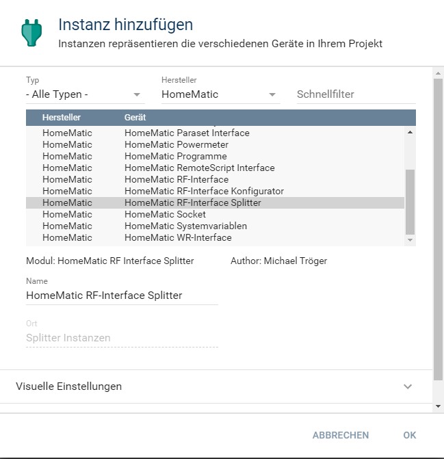
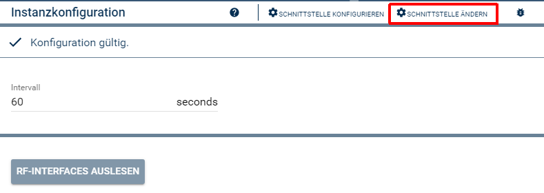
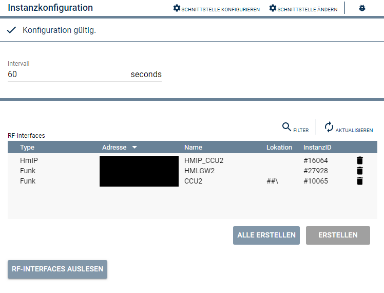

  

    
 

# HomeMatic RF-Interface Splitter  <!-- omit in toc -->
   Abrufen der Informationen für die Funk-Interfaces.  

## Dokumentation <!-- omit in toc -->

**Inhaltsverzeichnis**

- [1. Funktionsumfang](#1-funktionsumfang)
- [2. Installation](#2-installation)
- [3. Einrichten der Instanzen in IP-Symcon](#3-einrichten-der-instanzen-in-ip-symcon)
- [4. Statusvariablen und Profile](#4-statusvariablen-und-profile)
- [5. PHP-Befehlsreferenz](#5-php-befehlsreferenz)
- [6. Datenaustausch](#6-datenaustausch)
- [7. Lizenz](#7-lizenz)

## 1. Funktionsumfang

   Diese Instanz liest alle an einer CCU betriebenen Funk-Interfaces aus und stellt diese Daten den Instanzen 'HomeMatic RF-Interface' bereit.  

## 2. Installation

Dieses Modul ist Bestandteil der [HomeMaticExtended-Library](../).  

## 3. Einrichten der Instanzen in IP-Symcon

  
   Unter Instanz hinzufügen ist das Gerät 'HomeMatic RF-Interface Splitter' unter dem Hersteller 'HomeMatic' zu finden.  
   Diese Instanz wird automatisch erzeugt, sobald ein [HomeMatic RF-Interface Konfigurator](../RFInterfaceConfigurator/) erstellt wird.
   Nach dem Anlegen der Instanz sollte als übergeordnetes Gerät schon der HomeMatic Socket ausgewählt sein.  
   Existieren in IPS mehrere Homematic Socket, so ist über 'Schnittstelle ändern' der Homematic Socket auszuwählen, an welcher CCU die Funk-Interfaces ausgelesen werden sollen.  
     
   
**Konfigurationsseite:**  

  

   In dem Splitter ist der Intervall in Sekunden einzustellen, in welchem die Daten von der CCU gelesen werden sollen.  

| Eigenschaft |   Typ   | Standardwert |                 Funktion                 |
| :---------: | :-----: | :----------: | :--------------------------------------: |
|  Interval   | integer |      0       | Intervall in Sekunden für den Datenabruf |
 

## 4. Statusvariablen und Profile  

   Es werden keine Statusvariablen und Profile angelegt.  

## 5. PHP-Befehlsreferenz

   Es existieren keine PHP-Befehle für dieses Modul.  

## 6. Datenaustausch  

GUID für den Datenaustausch zwischen RF-Interface Splitter und RF-Interface:  

|              Device               |                  GUID                  |
| :-------------------------------: | :------------------------------------: |
| Senden zum RF-Interface Splitter  | {2F910A05-3607-4070-A6FF-53539E5D3BBB} |
| Empfang vom RF-Interface Splitter | {E2966A08-BCE1-4E76-8C4B-7E0136244E1B} |

## 7. Lizenz

  [CC BY-NC-SA 4.0](https://creativecommons.org/licenses/by-nc-sa/4.0/)  
