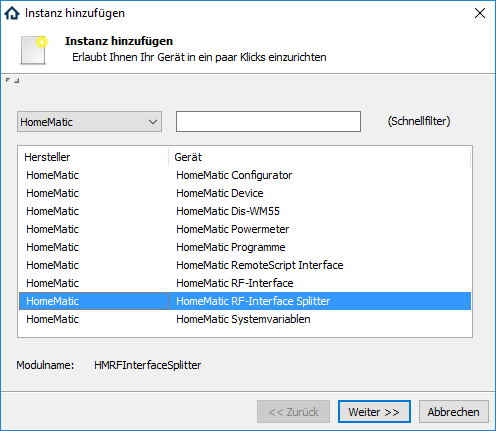

[](https://www.symcon.de/service/dokumentation/entwicklerbereich/sdk-tools/sdk-php/)
[]()
[]()  
[](https://www.symcon.de/forum/threads/30857-IP-Symcon-5-0-%28Stable%29-Changelog)
[](https://styleci.io/repos/34275278)  

# HomeMatic RemoteScript Interface  
   Native Schnittstelle zur CCU, um HomeMatic-Scripte durch die CCU ausführen zu lassen.  
   Direkte Rückmeldung der Ausführung durch einen Antwortstring im JSON-Format.  

## Dokumentation

**Inhaltsverzeichnis**

1. [Funktionsumfang](#1-funktionsumfang) 
2. [Installation](#2-installation)
3. [Einrichten der Instanzen in IP-Symcon](#3-einrichten-der-instanzen-in-ip-symcon)  
4. [Statusvariablen und Profile](#4-statusvariablen-und-profile)  
5. [PHP-Befehlsreferenz](#5-php-befehlsreferenz)   
6. [Lizenz](#6-lizenz)

## 1. Funktionsumfang

   Dies Instanz ermöglicht es eigene Homematic-Scripte zur CCU zu senden.  
   Des weiteren wird die Rückgabe der Ausführung an den Aufrufer zurück gegeben.  
   So kann z.B. per PHP-Script in IPS ein dynamisches Homematic-Script als String erstellt werden,  
   und die erfolgte Ausführung ausgewertet werden.  


## 2. Installation

Dieses Modul ist Bestandteil der HomeMaticExtended-Library.  


## 3. Einrichten der Instanzen in IP-Symcon


  
   Unter Instanz hinzufügen ist das Gerät 'HomeMatic RemoteScript Interface' unter dem Hersteller 'HomeMatic' zu finden.  
   Nach dem Anlegen der Instanz sollte als übergeordnetes Gerät schon der HomeMatic Socket ausgewählt sein.  
   Existieren in IPS mehrere Homematic Socket, so ist der auszuwählen, an welche CCU die Scripte gesendet werden sollen.  

**Konfigurationsseite:**  

  Es gibt keine konfigurierbaren Parameter.  

## 4. Statusvariablen und Profile  

   Es werden keine Statusvariablen und Profile angelegt.  

## 5. PHP-Befehlsreferenz

   ```php
    string HM_RunScript(integer $InstantID /*[HomeMatic RemoteScript Interface]*/,string $Script)
```
   **Beispiel:**

   Abfrage der Uhrzeit und Zeitzone von der CCU:
```php
    $HMScript = 'Now=system.Date("%F %T%z");' . PHP_EOL  
              . 'TimeZone=system.Date("%z");' . PHP_EOL;   
    $HMScriptResult = HM_RunScript(12345 /*[HomeMatic RemoteScript Interface]*/, $HMScript);  
    var_dump(json_decode($HMScriptResult));  
```

## 6. Lizenz

  [CC BY-NC-SA 4.0](https://creativecommons.org/licenses/by-nc-sa/4.0/)  
