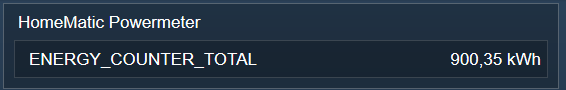

  

    
 

# HomeMatic Powermeter  <!-- omit in toc -->
   Abfragen des Summenzählers der Geräte mit Leistungsmessung aus der CCU.  

## Dokumentation <!-- omit in toc -->

**Inhaltsverzeichnis**

- [1. Funktionsumfang](#1-funktionsumfang)
- [2. Installation](#2-installation)
- [3. Einrichten der Instanzen in IP-Symcon](#3-einrichten-der-instanzen-in-ip-symcon)
- [4. Statusvariablen und Profile](#4-statusvariablen-und-profile)
- [5. WebFront](#5-webfront)
- [6. PHP-Befehlsreferenz](#6-php-befehlsreferenz)
- [7. Lizenz](#7-lizenz)

## 1. Funktionsumfang

   Die CCU legt für jeden 'Schaltaktor mit Leistungsmessung' und
   jeden Energiezähler 'HM-ES-TX' automatisch eine Systemvariable
   und ein Programm an, welches den Totalwert dieses Gerätes hoch zählt.  

   Dieser Wert wird auch bei Stromausfall bzw. ausstecken des entsprechenden Aktoren, gehalten.  

   Diese Systemvariable unterscheidet sich von den 'normalen' Systemvariablen dahingehend,
   dass Sie nicht in der der Übersicht aller Systemvariablen in der CCU auftaucht.  
   (Im Gegensatz zu den Regenmengen Zählern des OC3.)  

   Entsprechend war es nötig für diesen Typ von Systemvariable ein eigenes IPS-Device zu
   implementieren.  

## 2. Installation

Dieses Modul ist Bestandteil der [HomeMaticExtended-Library](../).  

## 3. Einrichten der Instanzen in IP-Symcon

  
   Unter Instanz hinzufügen ist das Gerät 'HomeMatic Powermeter' unter dem Hersteller
   'HomeMatic' zu finden.  

   Nach dem Anlegen der Instanz sollte als übergeordnetes Gerät schon der HomeMatic Socket
   ausgewählt sein.  
   Existieren in IPS mehrere Homematic Socket, so ist der auszuwählen, der der CCU
   entspricht an dem das Gerät angelernt ist.  

   Dieses Modul fragt den Wert aus der CCU immer dann ab, wenn der Wert
   der Variable 'GAS_ENERGY_COUNTER', 'IEC_ENERGY_COUNTER' oder 'ENERGY_COUNTER'
   des entsprechenden Gerätes sich in IPS aktualisiert.  
   Oder der IPS-Dienst startet bzw. wenn eine Instanz neu konfiguriert wurde.  

   Auch die HmIP Geräte mit Leistungsmessung funktionieren.  

**Konfigurationsseite:**  
  

   Im Einstellungsdialog der Instanz ist entsprechend die zugehörige
   'GAS_ENERGY_COUNTER', 'IEC_ENERGY_COUNTER' oder 'ENERGY_COUNTER'
   Variable des Aktoren auszuwählen, von dem der 'ENERGY_COUNTER_TOTAL' Wert
   gelesen werden soll.  

| Eigenschaft |   Typ   | Standardwert |                    Funktion                     |
| :---------: | :-----: | :----------: | :---------------------------------------------: |
|   EventID   | integer |      0       | Variable-ID von einem ENERGY_COUNTER Datenpunkt |

## 4. Statusvariablen und Profile  

Eine der folgende Statusvariablen wird automatisch angelegt, je nach verwendeten Gerät.  
**Statusvariable:**  

|      Name  /  Ident      |  Typ  |    Profil    |
| :----------------------: | :---: | :----------: |
| GAS_ENERGY_COUNTER_TOTAL | float |     ~Gas     |
| IEC_ENERGY_COUNTER_TOTAL | float | ~Electricity |
|   ENERGY_COUNTER_TOTAL   | float | ~Electricity |

**Profile:**  
Es werden die IPS-Profile ~Electricity und ~Gas genutzt, neue Profile werden nicht angelegt.  

## 5. WebFront  

Die direkte Darstellung im WebFront ist möglich, es wird aber empfohlen mit Links zu arbeiten.  
  

## 6. PHP-Befehlsreferenz

   Es existieren keine PHP-Befehle für dieses Modul.  

## 7. Lizenz

  [CC BY-NC-SA 4.0](https://creativecommons.org/licenses/by-nc-sa/4.0/)  
