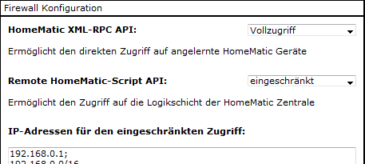
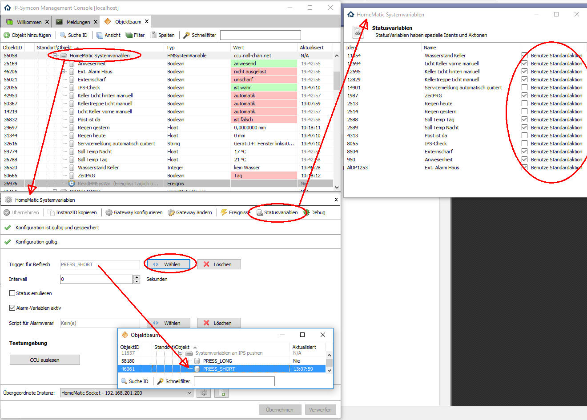
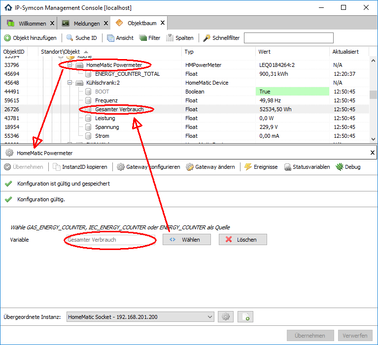
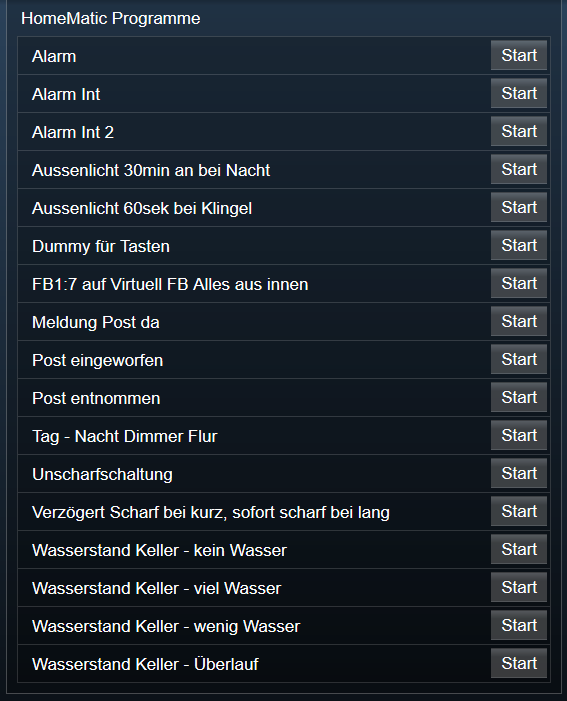
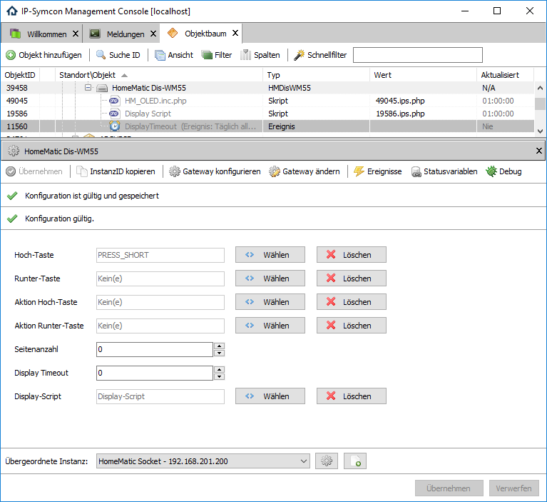
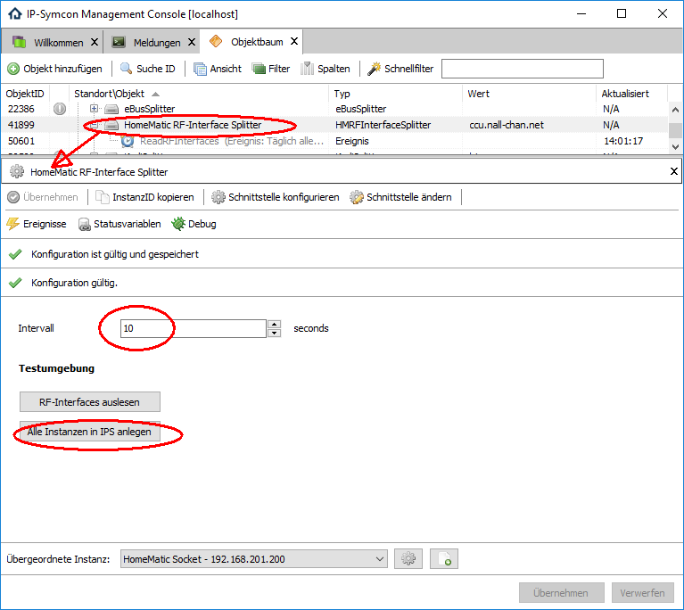
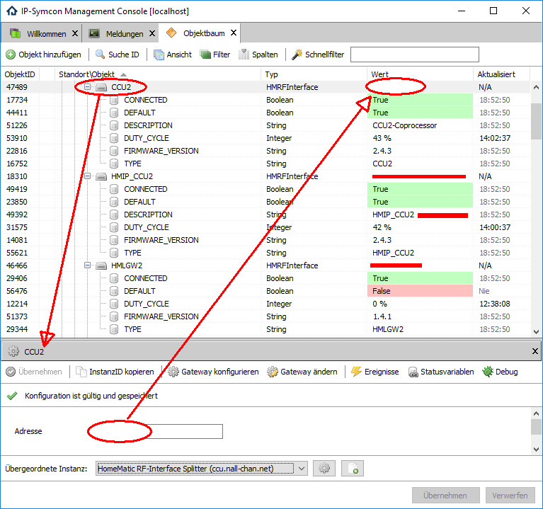

# IPSHomeMaticExtended
Erweitert IPS um die native Unterstützung von:

* Systemvariablen der CCU
* Programmen auf der CCU
* Summenzähler der Leistungsmesser
* Display Status-Anzeige
* HomeMaticScript
* Status der Funk-Interfaces

## Dokumentation

**Inhaltsverzeichnis**

1. [Funktionsumfang](#1-funktionsumfang) 
2. [Voraussetzungen](#2-voraussetzungen)
3. [Installation](#3-installation)
4. [HomeMatic Systemvariablen](#4-homematic-systemvariablen)
5. [HomeMatic Powermeter](#5-homematic-powermeter)
6. [HomeMatic Programme](#6-homematic-programme)
7. [HomeMatic WM55-Dis](#7-homematic-wm55-dis)
8. [HomeMatic-Script](#8-homematic-script) 
11. [Anhang](#11-anhang)
12. [Lizenz](#12-lizenz)

## 1. Funktionsumfang

### HomeMatic Systemvariablen

   Abfragen von System- und Alarmvariablen inkl. Profilen und Werten von der CCU.  
   Schreiben von Werten der Systemvariablen zur CCU.  
   Standard Actionhandler für die Bedienung der System- und Alarmvariablen aus dem IPS-Webfront.  
   Die Alarmvariablen werden erst ab IPS 4.1 untersützt.  

### HomeMatic Powermeter
   Abfragen des Summenzählers der Geräte mit Leistungsmessung aus der CCU.  
   Ab IPS 4.1 werden alle Geräte unterstützt, bei IPS 3.x nur Geräte mit dem Datenpunk 'ENERGY_COUNTER'.  

### HomeMatic Programme
   Abfragen der auf der CCU vorhandenen HM-Programme.  
   Ausführen der HM-Programme auf der CCU.  
   Standard Actionhandler für die Bedienung der HM-Programme aus dem IPS-Webfront.  

### HomeMatic Dis-WM55
   Dynamische Textanzeige auf dem Display-Wandtaster mit Statusdisplay.  
   Unterstützt mehrseite Anzeigen und das durchblättern per Tastendruck.  
   Ausführen von benutzerspezifischen Aktionen, auch in Abhängigkeit der angezeigten Seite.  
   
### HomeMatic RemoteScript Interface
   Native Schnittstelle zur CCU, um HomeMatic-Scripte durch die CCU ausführen zu lassen.  
   Direkte Rückmeldung der Ausführung durch einen Antwortstring im JSON-Format.  

### HomeMatic RF-Interface Splitter (ab IPS 4.1)
   Auslesen der Informationen zu jedem Funk-Interface der CCU.

### HomeMatic RF-Interface (ab IPS 4.1)
   Bereitstellen der Informationen zu den Funk-Interfaces innerhalb von IPS.

### Besonderheiten
   XML-API-Patch wird nicht benötigt.  
   Unterstützung von mehreren CCUs.  
   Einfache Einrichtung und Handhabung.  
   PHP-Befehle entsprechen dem vorhandenen Standard von IPS.  
 
## 2. Voraussetzungen

   Funktionsfähige CCU1 und/oder CCU2, welche schon mit einem HomeMatic Socket in IPS eingerichtet ist.  
   In der CCU muß die Firewall entsprechend eingerichtet sein, das IPS auf die 'Remote HomeMatic-Script API' der CCU zugreifen kann.  

    Einstellungen -> Systemsteuerung -> Firewall

   Bei 'Remote HomeMatic-Script API' muß entweder 'Vollzugriff' oder 'Eingeschränkt' eingestellt sein.
   Bei 'Eingeschränkt' ist dann unter 'IP-Adressen für eingeschränkten Zugriff' euer LAN / IPS-PC einzugeben.  
   (z.B. 192.168.178.0/24 => /24 ist die Subnet-Maske für das Netzwerk. Bei 255.255.255.0 ist das 24 bei 255.255.0.0. ist es 16.  
   Oder es kann direkt eine einzelne Adresse eingetragen werden. z.B. 192.168.0.2  

  


## 3. Installation

### IPS 3.x  
        Kopieren von der HMSysVar.dll in das Unterverzeichniss 'modules' unterhalb des IP-Symcon Installationsverzeichnisses.  
        Der Ordner 'modules' muss u.U. manuell angelegt werden.
        Beispiel: 'C:\\IP-Symcon\\modules'  
        IPS-Dienst Neustarten.  

### IPS 4.1  oder neuer
        über das 'Modul Control' folgende URL hinzufügen:  
        `git://github.com/Nall-chan/IPSHomematicExtended.git`  

### Allgemein
   Geräte sind im Diaog 'Instanz hinzufügen' unter dem Hersteller 'HomeMatic' zu finden.  
   **Bei kommerzieller Nutzung (z.B. als Errichter oder Integrator) wenden Sie sich bitte an den Autor.**  

  

## 4. HomeMatic Systemvariablen

   Unter Instanz hinzufügen sind die 'HomeMatic Systemvariablen' unter dem Hersteller 'HomeMatic' zu finden.  
   Nach dem Anlegen der Instanz sollte als übergeordnetes Gerät schon der HomeMatic Socket ausgewählt sein.  
   Existieren in IPS mehrere Homematic Socket, so ist der auszuwählen, der der CCU entspricht von dem die Systemvariablen gelesen werden sollen.  

   Dieses Modul unterstützt zwei Möglichkeiten die Systemvariablen von der CCU abzufragen:  

   - Abfrage erfolgt über einen einstellbaren Intervall (Pull).  

   - Die CCU löst einen Tastendruck einer virtuellen Fernbedienung aus,  
     welche in diesem Modul als Trigger für eine Abfrage verwendet wird (Push).

    **Vor/Nachteile der beiden Varianten:**

    * Intervall (Pull):  
        - \+ Benötigt kein Programm in der CCU.  
        - \- Änderungen werden in IPS nur mit Verzögerung erkannt.  
        - \- Unnötige Abfragen der CCU, wenn sich kein Wert in der CCU geändert hat.  
        - \- Hierdurch unnötiger Netzwerkverkehr und CPU-Rechenzeit der CCU und des IPS-Systems.  
        - \- Rückmeldung im WebFront nach auslösen einer Aktion kann bis zur Intervallzeit  
             verzögert dargestellt werden. (Status emulieren einschalten um Dies zu unterbinden.)  

    * Trigger von der CCU (Push):  
        - \- Benötigt ein Zentralenprogramm in der CCU, welches bei Aktualisierung von  
             Systemvariablen einen Tastendruck einer virtuellen Fernbedienung auslöst.  
        - \+ Änderungen werden sofort erkannt.  
        - \+ Unnötige Abfragen werden minimiert.  
        - \+ Rückmeldung im WebFront nach auslösen einer Aktion, entspricht sofort dem Wert der CCU.  

    Für die Intervall-Variante ist die Einstellung des Abfrage-Intervalls in Sekunden
    vorzunehmen, und bei Bedarf der Haken bei 'Status emulieren' zu setzen.

    Für die Trigger-Variante ist der in dem Zentralenprogramm der CCU verwendete
    Datenpunkt der virtuellen Fernbedienung unter 'Trigger für Refresh' auszuwählen
    (z.B. PRESS_SHORT).  

    **Hinweis:** Über den Homematic Konfigurator in IPS kann das benötigte Homematic Device
    komfortabel angelegt werden.  

  

    Mit dem Testcenter des Einstellungsdialog können die Systemvariablen sofort eingelesen
    werden, ohne auf den Intervall oder einen Trigger zu warten.  

    Unter dem Reiter 'Statusvariablen' sollten jetzt alle (\* siehe Powermeter) in der CCU
    vorhandenen Systemvariablen angezeigt werden.  

    Hier kann mit dem entfernen des Haken 'Benutze Standardaktion' die Bedienung einer
    Variable, aus dem WebFront heraus, unterbunden werden.  
  

    **Achtung:**  
    Die Profile der Systemvariablen werden nur beim Anlegen in IPS aus der CCU ausgelesen
    und übernommen.  
    Später in der CCU vorgenommene Änderungen an dem Profil einer Systemvariable werden nicht abgeglichen !  
    Änderungen sind dann entweder von Hand in IPS durchzuführen, oder das entsprechende Profil
    ist manuell zu löschen, es wird dann automatisch neu angelegt.

    Manuelle Änderungen an den Profilen sind teilweise nötig, da die CCU nur begrenzt
    Informationen zur Verfügung stellt.
    Dies betrifft z.B. die Schrittweite und die Anzahl der Kommastellen bei Float-Variablen.

    Außerdem können die Profile individuell verändert / ergänzt werden, dieses Modul ändert
    vorhandene Profile nicht.

    Der Profilname lautet immer:
    'HM.SysVar\<ID der Systemvariablen Instanz\>.\<IDENT der Systemvariable\>; (z.B. HM.SysVar12345.950).  

    Alle Statusvariablen dieses Moduls werden so benannt wie in der CCU.  

    **Hinweis:**  
    Namensänderungen in IPS werden durch die CCU immer überschrieben!  
    In der CCU gelöschte Systemvariablen, werden in IPS nicht antomatisch gelöscht.  

    Alle aus der CUU ausgelesenen Werte werden in IPS aufgrund des Zeitstempels der
    CCU-Variable und der IPS-Variable abgeglichen.  
    Somit werden unnötige Variablen-Updates in IPS vermieden, wenn die Variable in der
    CCU gar nicht aktualisiert wurde.  

    Hierbei ist es irrelevant ob sich der Wert geändert hat, ausschlaggebend ist die
    Aktualisierung.  

    Eventuelle Differenzen der Uhrzeiten und/oder Zeitzonen beider Systeme werden dabei
    automatisch berücksichtigt und erfordern somit keinen Eingriff durch den Benutzer.  

  

    **Hinweis:**  
    Eine Aktualisierung einer Alarmvariable, kann ein in der Instanz hinterlegtes Script starten.  
    Hierzu werden folgene Werte in der Variable $_IPS übergeben und stehen im Alarm-Script zur Verfügung.  

| Indexname   | Type    | Bedeutung                          |
| :---------: | :-----: | :--------------------------------: |
| Channel     | string  | Kannalbezeichnung des Melders      |
| ChannelName | string  | Bezeichnung des Kanals aus der CCU |
| DP          | string  | Bezeichnung des Datenpunktes       |
| FirstTime   | integer | Erste Auslösung (Unixtimestamp)    |
| LastTime    | integer | Letzte Auslösung (Unixtimestamp)   |
| OLDVALUE    | boolean | Vorheriger Wert                    |
| SENDER      | string  | FixWert 'AlarmDP'                  |
| VALUE       | boolean | Aktueller Wert                     |
| VARIABLE    | integer | ObjektID der Alarmvariable         |


    
### PHP-Funktionen

   Um einen Wert einer Systemvariable aus IPS heraus in die CCU zu schreiben, werden die
   schon vorhandenen HM_WriteValue* Befehle von IPS genutzt.  

   Hier entspricht der Parameter mit dem Namen 'Parameter' dem IDENT der Systemvariable.  
   (Die IDENT werden unter dem Reiter 'Statusvariablen' des Einstellungsdialogs der Instanz angezeigt.)  

   **ACHTUNG bei IPS 4.1: Aktuell müssen die Funktionen HM_WriteValueBoolean2, HM_WriteValueFloat2, HM_WriteValueInteger2 und HM_WriteValueString2 verwendet werden!**  

   **Beispiele:**  

```php
    HM_WriteValueBoolean(12345 /*[HomeMatic Systemvariablen]*/, '950' /* IDENT von Anwesenheit */, true);  
    HM_WriteValueFloat(12345 /*[HomeMatic Systemvariablen]*/, '2588' /* IDENT von Solltemp Tag */, 21.0);  
    HM_WriteValueInteger(12345 /*[HomeMatic Systemvariablen]*/, '12829', 56);  
    HM_WriteValueString(12345 /*[HomeMatic Systemvariablen]*/, '14901', 'TestString');  
```

   Die Alarme können ebenfalls aus IPS heraus bestätigt werden, hier für die Funktion HM_AlarmReceipt zu verwenden.  

```php
    HM_AlarmReceipt(12345 /*[HomeMatic Systemvariablen]*/, 'AlDP1253' /* IDENT von Ext. Alarm Haus */);  
```
   Diese Funktion liefert einen bool Rückgabewert.
   True bei Erfolg, im Fehlerfall False.  

## 5. HomeMatic Powermeter

   Die CCU legt für jeden 'Schaltaktor mit Leistungsmessung' und
   jeden Energiezähler 'HM-ES-TX' automatisch eine Systemvariable
   und ein Programm an, welches den Totalwert dieses Gerätes hoch zählt.  

   Dieser Wert wird auch bei Stromausfall bzw. ausstecken des entsprechenden Aktors, gehalten.  

   Diese Systemvariable unterscheidet sich von den 'normalen' Systemvariablen dahingehend,
   dass Sie nicht in der der Übersicht aller Systemvariablen in der CCU auftaucht.  
   (Im Gegensatz zu den Regenmengen Zählern des OC3.)  

   Entsprechend war es nötig für diesen Typ von Systemvariable ein eingenes IPS-Device zu
   implementieren.  

   Unter Instanz hinzufügen ist das Gerät 'HomeMatic Powermeter' unter dem Hersteller
   'HomeMatic' zu finden.  

   Nach dem Anlegen der Instanz sollte als übergeordnetes Gerät schon der HomeMatic Socket
   ausgewählt sein.  
   Existieren in IPS mehrere Homematic Socket, so ist der auszuwählen, der der CCU
   entspricht an dem das Gerät angelernt ist.  

   Dieses Modul fragt den Wert aus der CCU immer dann ab, wenn der Wert
   der Variable 'GAS_ENERGY_COUNTER', 'IEC_ENERGY_COUNTER' oder 'ENERGY_COUNTER'
   des entsprechenden Gerätes sich in IPS aktualisiert.  
   Oder der IPS-Dienst startet bzw. wenn eine Instanz neu konfiguriert wurde.  

   Im Einstellungsdialog der Instanz ist entsprechend die zugehörige
   'GAS_ENERGY_COUNTER', 'IEC_ENERGY_COUNTER' oder 'ENERGY_COUNTER'
   Variable des Aktors auszuwählen, von dem der 'ENERGY_COUNTER_TOTAL' Wert
   gelesen werden soll.  

  

   Als Profil für diese Variable ist ein Standard-IPS-Profil zugeordnet, und die Werte werden
   automatisch nach kWh umgerechnet.  

   Tip: Auch die HmIP Geräte mit Leistungsmessung funktionieren.  

  

   
## 6. HomeMatic Programme

   Die auf der CCU eingerichteten Programme können mit dieser Instanz ausgelesen und auch gestartet werden.  

   Unter Instanz hinzufügen sind die 'HomeMatic Programme' unter dem Hersteller 'HomeMatic' zu finden.  
   Nach dem Anlegen der Instanz sollte als übergeordnetes Gerät schon der HomeMatic Socket ausgewählt sein.  
   Existieren in IPS mehrere Homematic Socket, so ist der auszuwählen, aus welcher CCU die Programme gelesen werden sollen.  

   Dieses Modul hat keinerlei Einstellungen, welche konfiguriert werden müssen.  

   Im Testcenter ist es jedoch über den Button 'CCU auslesen' möglich, die auf der CCU vorhandenen Programme auszulesen.  
   Dies erfolgt auch autoamtisch bei Systemstart von IPS und wenn die Instanz angelegt wird.  

   Die Programme werden als Integer-Variable unterhalb der Instanz erzeugt. Es wird automatisch der Name und die Beschreibung aus der CCU übernommen.  

  

   Des weiteren wird ein Standard-Profil 'Execute-HM' angelegt und den Variablen zugeordnet.  

   Es ist somit sofort möglich die Programme aus dem WebFront heraus zu starten.  

   Werden in der CCU Programme gelöscht, so müssen die dazugehörigen Variablen in IPS bei Bedarf manuell gelöscht werden.  

  

### PHP-Funktionen

```php
    boolean HM_ReadPrograms(integer $InstantID /*[HomeMatic Programme]*/)
```
   Alle Programme auf der CCU werden ausgelesen und bei Bedarf umbenannt oder neu angelegt.

```php
    boolean HM_StartProgram(integer $InstantID /*[HomeMatic Programme]*/, string $IDENT);
```
   Startet ein auf der CCU hinterlegtes Programm. Als `$IDENT` muss der Ident der Variable des Programmes übergeben werden.  
   (Die IDENT werden unter dem Reiter 'Statusvariablen' des Einstellungsdialogs der Instanz angezeigt.)  

   Diese Funktionen liefern einen bool Rückgabewert.
   True bei Erfolg, im Fehlerfall False.  

   **Beispiele:**

```php
    $Erfolg = @HM_ReadPrograms(12345 /*[HomeMatic Programme]*/);  
    if ($Erfolg === false) echo "Fehler beim Lesen der Programme";  

    $Erfolg = @HM_StartProgram(12345 /*[HomeMatic Programme]*/, '4711' /* IDENT von Programm Licht Alles aus */);  
    if ($Erfolg === false) echo "Fehler beim starten des Programm";  
```

## 7. HomeMatic WM55-Dis

   Hier handelt es sich um eine Instanz, welche die Verwendung des farbigen Statusdisplays im 55er-Rahmen vereinfachen soll.  
   Über eine konfigurierbare Anzahl von 'Seiten' ist es möglich verschiedene Inhalte darzustellen und durch diese zu blättern (z.B. mit den beiden Tasten der Statusanzeige).  
   Für die darzustellenen Inhalte muss das unterhalb der Instanz erzeugt Display-Script den eigenen Bedürfnissen angepaßt werden.  
   Grundsätzlich ist die Statusanzeige nur empfangsbereit, und stellt eine Inhalt auf dem Display dar, wenn unmittelbar zuvor eine der beiden Tasten gedrückt wurde.  
   Hierzu ist wenigstens eine der vier Felder "Hoch-Taste", "Runter-Taste", "Aktion Hoch-Taste" oder "Aktion Runter-Taste" mit einem der PRESS Datenpunkte der Statusanzeige zu belegen.  
   Wird von IPS ein Telegramm mit einem der vier Datenpunkte empfange, so wird das "Display-Script" mit den entsprechenden Parametern ausgeführt und das Ergebnis anschließend zur Statusanzeige übertragen.  
   Die Anzahl der möglichen Seiten läßt sich in der Konfiguration der Instanz einstellen (1 ist auch möglich).  
   Ebenso ist das Timeout einstellbar, nach wieviel Sekunden wieder auf Seite 1 gesprungen wird.  
  
   Unter Instanz hinzufügen ist das Gerät 'HomeMatic WM55-Dis' unter dem Hersteller 'HomeMatic' zu finden.  
   Nach dem Anlegen der Instanz sollte als übergeordnetes Gerät schon der HomeMatic Socket ausgewählt sein.  
   Existieren in IPS mehrere Homematic Socket, so ist der auszuwählen, an welcher CCU das Ststusdisplay angelern ist.  

   Bei dem anlegen der Instanz wird automatisch ein Demo Display-Script erzeugt.  
   Details zu diesem Script und die dort Verfügbaren $_IPS-Variablen, sind dem Script selbst zu entnehemen.  

    


## 8. HomeMatic-Script

   Dies Instanz ermöglicht es eigene Homematic-Scripte zur CCU zu senden.  
   Des weiteren wird die Rückgabe der Ausführung an den Aufrufer zurück gegeben.  
   So kann z.B. per PHP-Script in IPS ein dynamisches Homematic-Script als String erstellt werden,  
   und die erfolgte Ausführung ausgewertet werden.  

   Unter Instanz hinzufügen ist das Gerät 'HomeMatic RemoteScript Interface' unter dem Hersteller 'HomeMatic' zu finden.  
   Nach dem Anlegen der Instanz sollte als übergeordnetes Gerät schon der HomeMatic Socket ausgewählt sein.  
   Existieren in IPS mehrere Homematic Socket, so ist der auszuwählen, an welche CCU die Scripte gesendet werden sollen.  


### PHP-Funktionen  

 ```php
    string HM_RunScript(integer $InstantID /*[HomeMatic RemoteScript Interface]*/,string $Script)
```
   **Beispiel:**

   Abfrage der Uhrzeit und Zeitzone von der CCU:
```php
    $HMScript = 'Now=system.Date("%F %T%z");' . PHP_EOL  
              . 'TimeZone=system.Date("%z");' . PHP_EOL;   
    $HMScriptResult = HM_RunScript(12345 /*[HomeMatic RemoteScript Interface]*/, $HMScript);  
    var_dump(json_decode($HMScriptResult));  
```

## 9. HomeMatic RF-Interface Splitter

   Dies Instanz liest alle an einer CCU betriebenen Funk-Interfaces aus und stellt die Daten den Instanzen 'HomeMatic RF-Interface' bereit.

   Unter Instanz hinzufügen ist das Gerät 'HomeMatic RF-Interface Splitter' unter dem Hersteller 'HomeMatic' zu finden.  
   Nach dem Anlegen der Instanz sollte als übergeordnetes Gerät schon der HomeMatic Socket ausgewählt sein.  
   Existieren in IPS mehrere Homematic Socket, so ist der auszuwählen, an welche CCU die Funk-Interfaces ausgelesen werden sollen.  

   Über den Button 'Alle Instanzen in IPS anlegen' werden automatisch alle an der CCU vorhandenen Funk-Interfaces als Instanz in IPS erzeugt.  
   Des weiteren ist in dem Splitter der Intervall in Sekunden einzustellen, in welchem die Daten von der CCU gelesen werden sollen.  

  

## 10. HomeMatic RF-Interface

   Dies Instanz stellt alle Daten eines an einer CCU betriebenen Funk-Interfaces dar.

   Unter Instanz hinzufügen ist das Gerät 'HomeMatic RF-Interface' unter dem Hersteller 'HomeMatic' zu finden.  
   Nach dem Anlegen der Instanz sollte als übergeordnetes Gerät schon der 'HomeMatic RF-Interface Splitter' ausgewählt sein.  
   Existieren in IPS mehrere 'HomeMatic RF-Interface Splitter', so ist der auszuwählen, an welche CCU dieses Funk-Interface angeschlossen ist.  

   Da das auslesen der Adresse der Funk-Interfaces über die WebUI der CCU relativ schwierig ist, ist es einfach diese Instanzen automatisch durch den Splitter anlegen zu lassen (siehe oben).

  

  

## 11. Anhang

**GUID's:**  
GUIDs der Instanzen (z.B. wenn Instanz per PHP angelegt werden soll):  

| Device                           | GUID                                   |
| :------------------------------: | :------------------------------------: |
| HomeMatic Systemvariablen        | {400F9193-FE79-4086-8D76-958BF9C1B357} |
| HomeMatic Powermeter             | {AF50C42B-7183-4992-B04A-FAFB07BB1B90} |
| HomeMatic Programme              | {A5010577-C443-4A85-ABF2-3F2D6CDD2465} |
| HomeMatic RemoteScript Interface | {246EDB89-70BC-403B-A1FA-3B3B1B540401} |
| HomeMatic Dis-WM55               | {271BCAB1-0658-46D9-A164-985AEB641B48} |
| HomeMatic RF-Interface Splitter  | {6EE35B5B-9DD9-4B23-89F6-37589134852F} |
| HomeMatic RF-Interface           | {36549B96-FA11-4651-8662-F310EEEC5C7D} |


**Eigenschaften von HomeMatic Systemvariablen:**  

| Eigenschaft     | Typ     | Standardwert | Funktion                                                    |
| :-------------: | :-----: | :----------: | :---------------------------------------------------------: |
| EventID         | integer | 0            | Variablen-ID welche einen Refresh auslöst                   |
| Interval        | integer | 0            | Intervall in Sekunden für den Datenabruf                    |
| EmulateStatus   | boolean | false        | Wert der Systemvariable wartet nicht auf Rückmeldung        |
| EnableAlarmDP   | boolean | true         | Aktiviert die verarbeitung von Alarmvariablen               |
| AlarmScriptID   | integer | 0            | Script-ID welches bei der Alarmverarbeitung ausgeführt wird |

**Eigenschaften von HomeMatic Powermeter:**  

| Eigenschaft     | Typ     | Standardwert | Funktion                                        |
| :-------------: | :-----: | :----------: | :---------------------------------------------: |
| EventID         | integer | 0            | Variable-ID von einem ENERGY_COUNTER Datenpunkt |

**Eigenschaften von HomeMatic Programme:**  

 Keine Eigenschaften vorhanden.  

**Eigenschaften von HomeMatic RemoteScript Interface:**  

 Keine Eigenschaften vorhanden.  

**Eigenschaften von HomeMatic Dis-WM55:**  

| Eigenschaft     | Typ     | Standardwert | Funktion                                             |
| :-------------: | :-----: | :----------: | :--------------------------------------------------: |
| PageUpID        | integer | 0            | Variablen-ID für die Funktion Seite hoch/zurück      |
| PageDownID      | integer | 0            | Variablen-ID für die Funktion Seite runter/weiter    |
| ActionUpID      | integer | 0            | Variablen-ID für die Funktion Aktion ausführen oben  |
| ActionDownID    | integer | 0            | Variablen-ID für die Funktion Aktion ausführen unten |
| MaxPage         | integer | 0            | Anzahl der Seiten                                    |
| Timeout         | integer | 0            | Zeit in Sekunden bis wieder Seite 1 angezeigt wird   |
| ScriptID        | integer | 0            | Script-ID welches beim Tastendruck ausgeführt wird   |

**Eigenschaften von HomeMatic RF-Interface Splitter:**

| Eigenschaft     | Typ     | Standardwert | Funktion                                      |
| :-------------: | :-----: | :----------: | :-------------------------------------------: |
| Interval        | integer | 0            | Intervall in Sekunden für den Datenabruf      |
 
**Eigenschaften von HomeMatic RF-Interface:**  

| Eigenschaft     | Typ     | Standardwert | Funktion                                      |
| :-------------: | :-----: | :----------: | :-------------------------------------------: |
| Address         | string  |              | Adresse des Interfaces                        |
 
**GUID's Datenaustausch:**  
GUIDs für den Datenaustausch zwischen RF-Interface Splitter und RF-Interface:  

| Device                            | GUID                                   | 
| :-------------------------------: | :------------------------------------: |
| Senden zum RF-Interface Splitter  | {2F910A05-3607-4070-A6FF-53539E5D3BBB} |
| Empfang vom RF-Interface Splitter | {E2966A08-BCE1-4E76-8C4B-7E0136244E1B} |

**Changelog:**

Version 2.07:  
 Fix: Summenzähler für Powermeter hat bei GAS falsche Werte geliefert.  
 Fix: Dis-WM55 ohne Funktion.  
 Fix: Dis-WM55 hat immer das Display-Script überschrieben.  
 New: Mehr Debug-Ausgaben bei Dis-WM55.  

Version 2.06:  
 Fix: Doku geändert (Final).  
 Fix: GUID für Empfang vom RF-Interface Splitter.  
 Fix: Trigger für Powermeter und Systemvariablen waren unter Umständen falsch.  
 Fix: HM-Systemvariablen vom Typ String wurden falsch dargestellt, wenn Umlaute enthalten waren.  
 
Version 2.05:  
 Fix: Unter Umständen konnte die Adresse der CCU nicht aus dem HomeMatic-Socket ermitteln werden.  
 New: Beschreibung in module.json ergänzt.

Version 2.04:  
 Fix: RFInstance-Splitter hat fehler gemeldet beim Anlegen von Instanzen, wenn keine vorhanden waren.  

Version 2.03:  
 Fix: Doku geändert (Teil1).

Version 2.02:  
 Fix: Powermeter-Instanz kann jetzt auch mit allen Varianten von HM-ES-TX-WM umgehen.  
 Fix: Powermeter-Instanz unterstützt jetzt auch HMIP-PSM und ähnliche HMIP-'Mess-Steckdosen'  

Version 2.01:  
 Neu: RF-Interface-Splitter zum auslesen der RF-Interfaces aus der CCU.  
 Neu: RF-Interface zum darstellen der Werte eines RF-Interfaces der CCU.  

Version 2.0:  

Version 1.5:  

Version 1.3:  

Version 1.1:  

## 12. Lizenz

  [CC BY-NC-SA 4.0](https://creativecommons.org/licenses/by-nc-sa/4.0/)  
