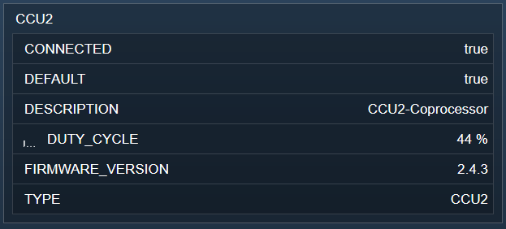

  

   
 

# HomeMatic RF-Interface  <!-- omit in toc -->
   Bereitstellen der Informationen zu den Funk-Interfaces innerhalb von IPS.

## Dokumentation <!-- omit in toc -->

**Inhaltsverzeichnis**

- [1. Funktionsumfang](#1-funktionsumfang)
- [2. Installation](#2-installation)
- [3. Einrichten der Instanzen in IP-Symcon](#3-einrichten-der-instanzen-in-ip-symcon)
- [4. Statusvariablen und Profile](#4-statusvariablen-und-profile)
- [5. WebFront](#5-webfront)
- [6. PHP-Befehlsreferenz](#6-php-befehlsreferenz)
- [7. Lizenz](#7-lizenz)

## 1. Funktionsumfang

   Dies Instanz stellt alle Daten eines an einer CCU betriebenen Funk-Interfaces dar.  

## 2. Installation

Dieses Modul ist Bestandteil der [HomeMaticExtended-Library](../).  

## 3. Einrichten der Instanzen in IP-Symcon

  
   Unter Instanz hinzufügen ist das Gerät 'HomeMatic RF-Interface' unter dem Hersteller 'HomeMatic' zu finden.  
   Nach dem Anlegen der Instanz sollte als übergeordnetes Gerät schon der 'HomeMatic RF-Interface Splitter' ausgewählt sein.  
   Existieren in IPS mehrere 'HomeMatic RF-Interface Splitter', so ist der auszuwählen, an welcher CCU dieses Funk-Interface angeschlossen ist.  

   Da das auslesen der Adresse der Funk-Interfaces über die WebUI der CCU relativ schwierig ist, wird empfohlen den zum Modul gehörenden [HomeMatic RF-Interface Konfigurator](../RFInterfaceConfigurator/) zu benutzen.   

**Konfigurationsseite:**  

  

| Eigenschaft |  Typ   | Standardwert |        Funktion        |
| :---------: | :----: | :----------: | :--------------------: |
|   Address   | string |              | Adresse des Interfaces |

## 4. Statusvariablen und Profile  

   Alle von der CCU gemeldeten Datenpunkte der Interfaces werden in IPS dargestellt.  
   Die folgenden Statusvariablen können durchaus variieren.  

|  Name  /  Ident  |   Typ   |     Profil     |
| :--------------: | :-----: | :------------: |
|    CONNECTED     | boolean |                |
|     DEFAULT      | boolean |                |
|   DESCRIPTION    | string  |                |
|    DUTY_CYCLE    | integer | ~Intensity.100 |
| FIRMWARE_VERSION | string  |                |
|       TYPE       | string  |                |

## 5. WebFront  

Die direkte Darstellung im WebFront ist möglich, es wird aber empfohlen mit Links zu arbeiten.  
  

## 6. PHP-Befehlsreferenz

   Es existieren keine PHP-Befehle für dieses Modul.  

## 7. Lizenz

  [CC BY-NC-SA 4.0](https://creativecommons.org/licenses/by-nc-sa/4.0/)  
