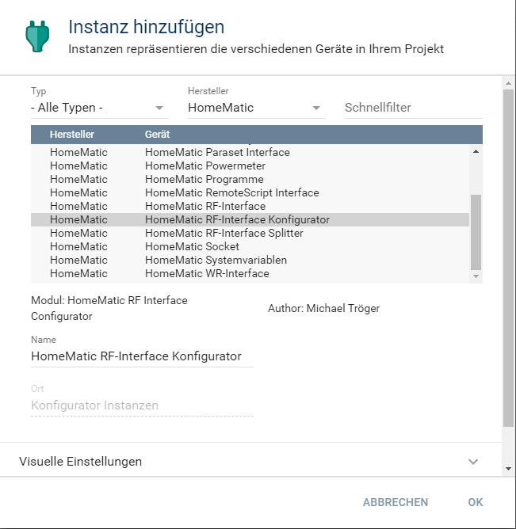
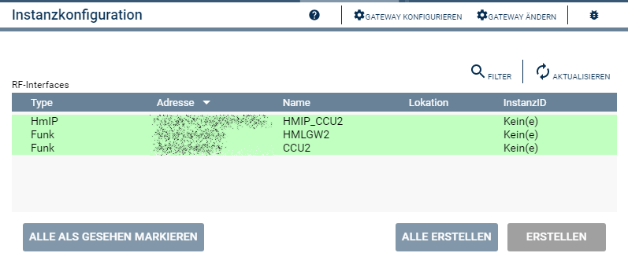

  

    

# HomeMatic RF-Interface Konfigurator  
   Zum erstellen der Funk-Interface Instanzen.  

## Dokumentation <!-- omit in toc -->

**Inhaltsverzeichnis**

- [1. Funktionsumfang](#1-funktionsumfang)
- [2. Installation](#2-installation)
- [3. Einrichten der Instanzen in IP-Symcon](#3-einrichten-der-instanzen-in-ip-symcon)
- [4. Statusvariablen und Profile](#4-statusvariablen-und-profile)
- [5. PHP-Befehlsreferenz](#5-php-befehlsreferenz)
- [6. Datenaustausch](#6-datenaustausch)
- [7. Lizenz](#7-lizenz)

## 1. Funktionsumfang

   Dies Instanz liest alle an einer CCU betriebenen Funk-Interfaces aus und stellt diese als Konfigurator innerhalb von IPS bereit.  

## 2. Installation

Dieses Modul ist Bestandteil der [HomeMaticExtended-Library](../).  

## 3. Einrichten der Instanzen in IP-Symcon

  
   Unter Instanz hinzufügen ist der Konfigurator 'HomeMatic RF-Interface Konfigurator' unter dem Hersteller 'HomeMatic' zu finden.  
   Nach dem Anlegen der Instanz wird automatisch ein benötigter [HomeMatic RF-Interface Splitter](../RFInterfaceSplitter/) erstellt und diesen wird als übergeordnetes Gerät der vorhandene HomeMatic Socket ausgewählt.  
   Existieren in IPS mehrere Homematic Socket, so ist im [HomeMatic RF-Interface Splitter](../RFInterfaceSplitter/)  unter 'Schnittstelle ändern' der Homematic Socket auszuwählen, an welcher CCU die Funk-Interfaces ausgelesen werden sollen.  

**Konfigurationsseite:**  

  

   Über den Button 'Alle erstellen' werden automatisch alle an der CCU vorhandenen Funk-Interfaces als Instanz in IPS erzeugt.  
   
## 4. Statusvariablen und Profile  

   Es werden keine Statusvariablen und Profile angelegt.  

## 5. PHP-Befehlsreferenz

   Es existieren keine PHP-Befehle für dieses Modul.  

## 6. Datenaustausch  

siehe [HomeMatic RF-Interface Splitter](../RFInterfaceSplitter/) 

## 7. Lizenz

  [CC BY-NC-SA 4.0](https://creativecommons.org/licenses/by-nc-sa/4.0/)  
