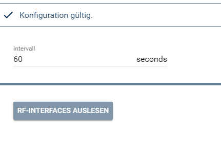

  

# HomeMatic RF-Interface Splitter (ab IPS 4.3)  
   Abrufen der Informationen für die Funk-Interfaces.  

## Dokumentation

**Inhaltsverzeichnis**

1. [Funktionsumfang](#1-funktionsumfang) 
2. [Installation](#2-installation)
3. [Einrichten der Instanzen in IP-Symcon](#3-einrichten-der-instanzen-in-ip-symcon)  
4. [Statusvariablen und Profile](#4-statusvariablen-und-profile)  
5. [PHP-Befehlsreferenz](#5-php-befehlsreferenz)   
6. [Datenaustausch](#6-datenaustausch)
7. [Lizenz](#7-lizenz)

## 1. Funktionsumfang

   Dies Instanz liest alle an einer CCU betriebenen Funk-Interfaces aus und stellt diese Daten den Instanzen 'HomeMatic RF-Interface' bereit.  

## 2. Installation

Dieses Modul ist Bestandteil der HomeMaticExtended-Library.  

## 3. Einrichten der Instanzen in IP-Symcon

  
   Unter Instanz hinzufügen ist das Gerät 'HomeMatic RF-Interface Splitter' unter dem Hersteller 'HomeMatic' zu finden.  
   Nach dem Anlegen der Instanz sollte als übergeordnetes Gerät schon der HomeMatic Socket ausgewählt sein.  
   Existieren in IPS mehrere Homematic Socket, so ist der auszuwählen, an welche CCU die Funk-Interfaces ausgelesen werden sollen.  

**Konfigurationsseite:**  

  

   Über den Button 'Alle Instanzen in IPS anlegen' werden automatisch alle an der CCU vorhandenen Funk-Interfaces als Instanz in IPS erzeugt.  
   Des weiteren ist in dem Splitter der Intervall in Sekunden einzustellen, in welchem die Daten von der CCU gelesen werden sollen.  

| Eigenschaft     | Typ     | Standardwert | Funktion                                      |
| :-------------: | :-----: | :----------: | :-------------------------------------------: |
| Interval        | integer | 0            | Intervall in Sekunden für den Datenabruf      |
 

## 4. Statusvariablen und Profile  

   Es werden keine Statusvariablen und Profile angelegt.  

## 5. PHP-Befehlsreferenz

   Es existieren keine PHP-Befehle für dieses Modul.  

## 6. Datenaustausch  

GUIDs für den Datenaustausch zwischen RF-Interface Splitter und RF-Interface:  

| Device                            | GUID                                   | 
| :-------------------------------: | :------------------------------------: |
| Senden zum RF-Interface Splitter  | {2F910A05-3607-4070-A6FF-53539E5D3BBB} |
| Empfang vom RF-Interface Splitter | {E2966A08-BCE1-4E76-8C4B-7E0136244E1B} |

## 7. Lizenz

  [CC BY-NC-SA 4.0](https://creativecommons.org/licenses/by-nc-sa/4.0/)  
