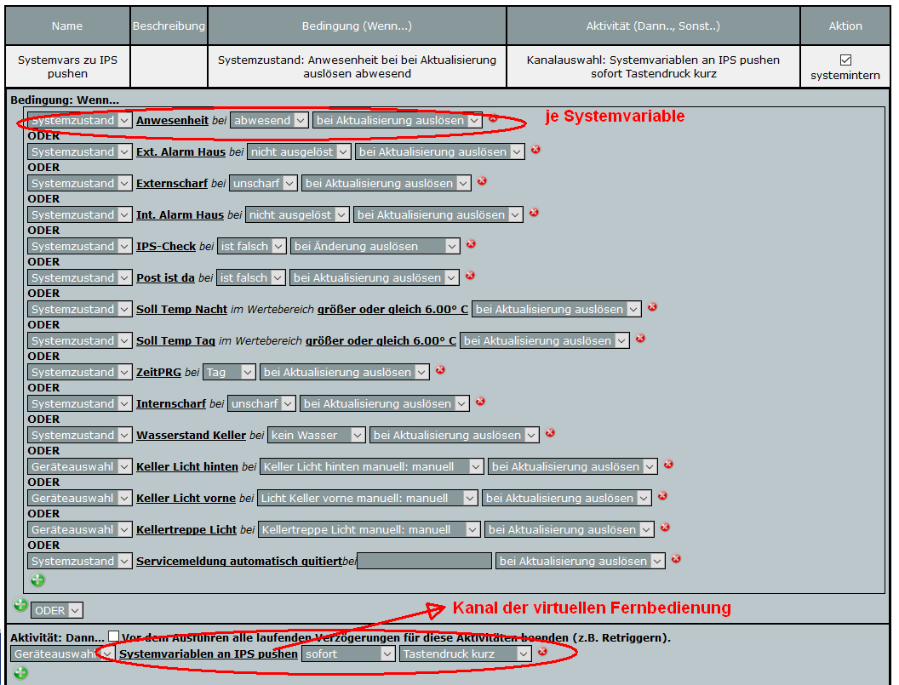
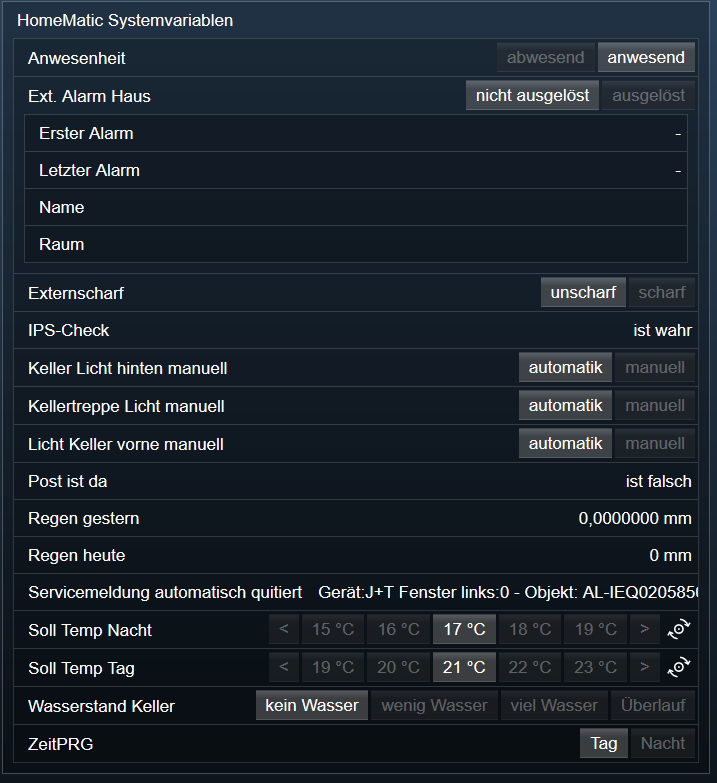
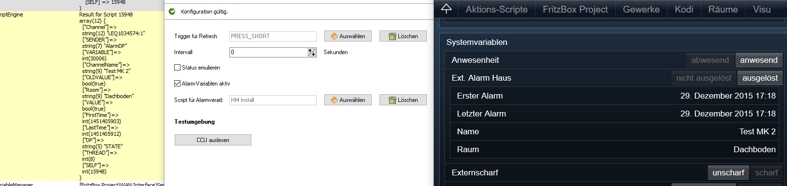

[](https://www.symcon.de/service/dokumentation/entwicklerbereich/sdk-tools/sdk-php/)
[]()
[](https://creativecommons.org/licenses/by-nc-sa/4.0/)  
[](https://community.symcon.de/t/ip-symcon-6-1-stable-changelog/40276-IP-Symcon-5-1-%28Stable%29-Changelog)
[](https://github.com/Nall-chan/HomematicExtended/actions) [](https://github.com/Nall-chan/HomematicExtended/actions)  
[](../README.md#6-spenden) 

# HomeMatic Systemvariablen  <!-- omit in toc -->
   Bereitstellen der System und Alarmvariablen einer CCU in IPS.  

## Dokumentation <!-- omit in toc -->

**Inhaltsverzeichnis**

- [1. Funktionsumfang](#1-funktionsumfang)
- [2. Installation](#2-installation)
- [3. Einrichten der Instanzen in IP-Symcon](#3-einrichten-der-instanzen-in-ip-symcon)
- [4. Statusvariablen und Profile](#4-statusvariablen-und-profile)
- [5. WebFront](#5-webfront)
- [6. PHP-Befehlsreferenz](#6-php-befehlsreferenz)
- [7. Lizenz](#7-lizenz)

## 1. Funktionsumfang

   Abfragen von System- und Alarmvariablen inkl. Profilen und Werten von der CCU.  
   Schreiben von Werten der Systemvariablen zur CCU.  
   Standard Actionhandler für die Bedienung der System- und Alarmvariablen aus dem IPS-Webfront.  

   Dieses Modul unterstützt zwei Möglichkeiten die Systemvariablen von der CCU abzufragen:  

   - Abfrage erfolgt über einen einstellbaren Intervall (Pull).  

   - Die CCU löst einen Tastendruck einer virtuellen Fernbedienung aus,  
     welche in diesem Modul als Trigger für eine Abfrage verwendet wird (Push).

    **Vor/Nachteile der beiden Varianten:**

    * Intervall (Pull):  
        - \+ Benötigt kein Programm in der CCU.  
        - \- Änderungen werden in IPS nur mit Verzögerung erkannt.  
        - \- Unnötige Abfragen der CCU, wenn sich kein Wert in der CCU geändert hat.  
        - \- Hierdurch unnötiger Netzwerkverkehr und CPU-Rechenzeit der CCU und des IPS-Systems.  
        - \- Rückmeldung im WebFront nach auslösen einer Aktion kann bis zur Intervallzeit  
             verzögert dargestellt werden. (Status emulieren einschalten um Dies zu unterbinden.)  

    * Trigger von der CCU (Push):  
        - \- Benötigt ein Zentralenprogramm in der CCU, welches bei Aktualisierung von  
             Systemvariablen einen Tastendruck einer virtuellen Fernbedienung auslöst.  
        - \+ Änderungen werden sofort erkannt.  
        - \+ Unnötige Abfragen werden minimiert.  
        - \+ Rückmeldung im WebFront nach auslösen einer Aktion, entspricht sofort dem Wert der CCU.  

    Für die Intervall-Variante ist die Einstellung des Abfrage-Intervalls in Sekunden
    vorzunehmen, und bei Bedarf der Haken bei 'Status emulieren' zu setzen.

    Für die Trigger-Variante ist der in dem Zentralenprogramm der CCU verwendete
    Datenpunkt der virtuellen Fernbedienung unter 'Trigger für Refresh' auszuwählen
    (z.B. PRESS_SHORT).  

    **Hinweis:** Über den Homematic Konfigurator in IPS kann das benötigte Homematic Device
    komfortabel angelegt werden.  
  

## 2. Installation

Dieses Modul ist Bestandteil der [HomeMaticExtended-Library](../).  


## 3. Einrichten der Instanzen in IP-Symcon


  
   Unter Instanz hinzufügen sind die 'HomeMatic Systemvariablen' unter dem Hersteller 'HomeMatic' zu finden.  
   Nach dem Anlegen der Instanz sollte als übergeordnetes Gerät schon der HomeMatic Socket ausgewählt sein.  
   Existieren in IPS mehrere Homematic Socket, so ist der auszuwählen, der der CCU entspricht von dem die Systemvariablen gelesen werden sollen.  

**Konfigurationsseite:**  

   Mit dem Testcenter des Einstellungsdialog können die Systemvariablen sofort eingelesen
   werden, ohne auf den Intervall oder einen Trigger zu warten.  

   Unter dem Reiter 'Statusvariablen' sollten jetzt alle (\* siehe Powermeter) in der CCU
   vorhandenen Systemvariablen angezeigt werden.  

   Hier kann mit dem entfernen des Haken 'Benutze Standardaktion' die Bedienung einer
   Variable, aus dem WebFront heraus, unterbunden werden.  
  

|  Eigenschaft  |   Typ   | Standardwert |                          Funktion                           |
| :-----------: | :-----: | :----------: | :---------------------------------------------------------: |
|    EventID    | integer |      0       |          Variablen-ID welche einen Refresh auslöst          |
|   Interval    | integer |      0       |          Intervall in Sekunden für den Datenabruf           |
| EmulateStatus | boolean |    false     |    Wert der Systemvariable wartet nicht auf Rückmeldung     |
| EnableAlarmDP | boolean |     true     |        Aktiviert die verarbeitung von Alarmvariablen        |
| AlarmScriptID | integer |      0       | Script-ID welches bei der Alarmverarbeitung ausgeführt wird |


## 4. Statusvariablen und Profile  

**Statusvariablen:**  
   Alle von der CCU gemeldeten Systemvariablen werden in IPS dargestellt.  
   Die Statusvariablen der Instanz  werden so benannt wie in der CCU.  

   Namensänderungen in IPS werden durch die CCU nicht überschrieben!  
   In der CCU gelöschte Systemvariablen, werden in IPS nicht automatisch gelöscht.  

   Alle aus der CUU ausgelesenen Werte werden in IPS aufgrund des Zeitstempels der
   CCU-Variable und der IPS-Variable abgeglichen.  
   Somit werden unnötige Variablen-Updates in IPS vermieden, wenn die Variable in der
   CCU gar nicht aktualisiert wurde.  

   Hierbei ist es irrelevant ob sich der Wert geändert hat, ausschlaggebend ist die Aktualisierung.  

   Eventuelle Differenzen der Uhrzeiten und/oder Zeitzonen beider Systeme werden dabei
   automatisch berücksichtigt und erfordern somit keinen Eingriff durch den Benutzer.  

   **Hinweis:**  
   Eine Aktualisierung einer Alarmvariable, kann ein in der Instanz hinterlegtes Script starten.  
   Hierzu werden Werte in der Variable $_IPS übergeben und stehen im Alarm-Script zur Verfügung.  
   Eine Übersicht aller Variablen ist in der [PHP-Befehlsreferenz](#6-php-befehlsreferenz) aufgelistet.  

**Profile:**  
   Die Profile der Systemvariablen werden nur beim Anlegen in IPS aus der CCU ausgelesen
   und übernommen.  
   Später in der CCU vorgenommene Änderungen an dem Profil einer Systemvariable werden nicht abgeglichen !  
   Änderungen sind dann entweder von Hand in IPS durchzuführen, oder das entsprechende Profil
   ist manuell zu löschen, es wird dann automatisch neu angelegt.

   Manuelle Änderungen an den Profilen sind teilweise nötig, da die CCU nur begrenzt
   Informationen zur Verfügung stellt.
   Dies betrifft z.B. die Schrittweite und die Anzahl der Kommastellen bei Float-Variablen.

   Außerdem können die Profile individuell verändert / ergänzt werden, dieses Modul ändert
   vorhandene Profile nicht.

   Der Profilname lautet immer:
   'HM.SysVar\<ID der Systemvariablen Instanz\>.\<IDENT der Systemvariable\>; (z.B. HM.SysVar12345.950).  

## 5. WebFront  

Die direkte Darstellung im WebFront ist möglich, es wird aber empfohlen mit Links zu arbeiten.  
  


## 6. PHP-Befehlsreferenz


   Um einen Wert einer Systemvariable aus IPS heraus in die CCU zu schreiben, werden die
   schon vorhandenen HM_WriteValue* Befehle von IPS genutzt.  

   Hier entspricht der Parameter mit dem Namen 'Parameter' dem IDENT der Systemvariable.  
   (Die IDENT werden unter dem Reiter 'Statusvariablen' des Einstellungsdialogs der Instanz angezeigt.)  

   **ACHTUNG bei IPS 4.3: Aktuell müssen die Funktionen HM_WriteValueBoolean2, HM_WriteValueFloat2, HM_WriteValueInteger2 und HM_WriteValueString2 verwendet werden!**  

   **Beispiele:**  

```php
    HM_WriteValueBoolean(12345 /*[HomeMatic Systemvariablen]*/, '950' /* IDENT von Anwesenheit */, true);  
    HM_WriteValueFloat(12345 /*[HomeMatic Systemvariablen]*/, '2588' /* IDENT von Solltemperatur Tag */, 21.0);  
    HM_WriteValueInteger(12345 /*[HomeMatic Systemvariablen]*/, '12829', 56);  
    HM_WriteValueString(12345 /*[HomeMatic Systemvariablen]*/, '14901', 'TestString');  
```

   Die Alarme können ebenfalls aus IPS heraus bestätigt werden, hier für die Funktion HM_AlarmReceipt zu verwenden.  

```php
    HM_AlarmReceipt(12345 /*[HomeMatic Systemvariablen]*/, 'AlDP1253' /* IDENT von Ext. Alarm Haus */);  
```
   Diese Funktion liefert einen bool Rückgabewert.
   True bei Erfolg, im Fehlerfall False.  

**Übersicht aller übergeben Variablen im Alarm-Script:**  
  

|  Indexname  |  Type   |             Bedeutung              |
| :---------: | :-----: | :--------------------------------: |
|   Channel   | string  |    Kanalbezeichnung des Melders    |
| ChannelName | string  | Bezeichnung des Kanals aus der CCU |
|     DP      | string  |    Bezeichnung des Datenpunktes    |
|  FirstTime  | integer |  Erste Auslösung (Unixtimestamp)   |
|  LastTime   | integer |  Letzte Auslösung (Unixtimestamp)  |
|  OLDVALUE   | boolean |          Vorheriger Wert           |
|   SENDER    | string  |         FixWert 'AlarmDP'          |
|    VALUE    | boolean |           Aktueller Wert           |
|  VARIABLE   | integer |     ObjektID der Alarmvariable     |


## 7. Lizenz

  [CC BY-NC-SA 4.0](https://creativecommons.org/licenses/by-nc-sa/4.0/)  
